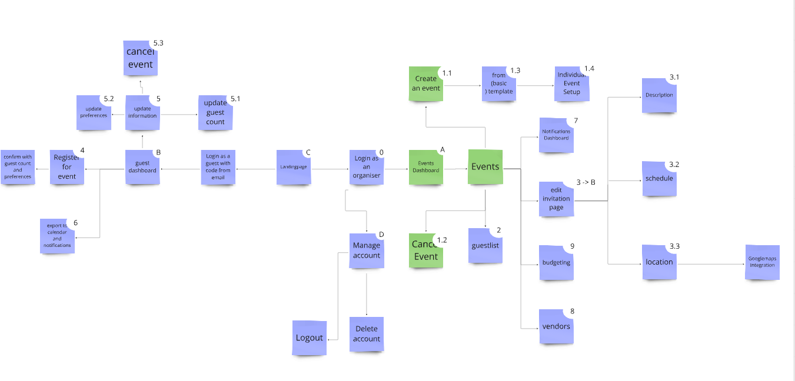
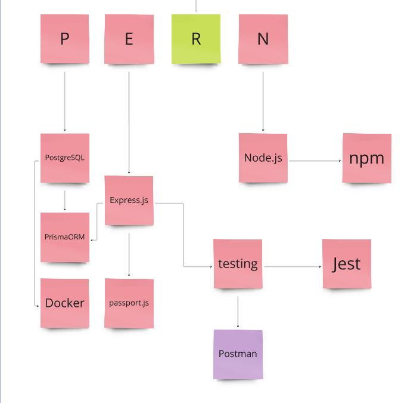

# Eventara

Welcome to our project's backend repo, Eventara is an Events Management System backend! it provides a robust platform for creating, organizing, and managing events all in one place. From handling guest lists and RSVPs to managing vendors and budgets, this project providesa seamless event planning experience.

[Check out the front-end Repo](https://github.com/amjadkouayed/event-ms-frontend)  

[Our miro planning board](https://miro.com/welcomeonboard/R2VQbkNsNHdVOFBTY2J6ZTBBVnVicmg3S2MxOWJNdWtxV2V0bUN3dFZ3bCtVc3V3ZjltdVVMQ2c5MWNuRTZZeTdZNzI2QWpkbXljRDJveWpCRGloUFNpbU9WaEpXc0ZJbDVrUkhSaTRZcFVUeVR3czFFdkpnWStITjNZTzVJVmUhZQ==?share_link_id=803532159551)

## Features

- **Event Management**: create, update, delete and organize all of your events in one place
- **Guest Management**: Maintain a comprehensive guest list and send invitations effortlessly.
- **RSVP Functionality**: Create custom invitation pages, receive guest confirmations or cancellations, and track their preferences.
- **Notification System**: Stay informed with guest updates and send notifications about event changes.
- **Vendor Management**: Manage vendor details and contacts linked to specific events
- **Budgeting Managment**: Manage budgeting for the event

## Tech Stack

- **Language**: JavaScript (Node.js)
- **Framework**: Express.js
- **Database**: postgreSql
- **Authentication**: passport-JWT
- **ORM**: Prisma

## Progress

- express server setup
- authentication: JWT passport setup
- Database and Prisma
- login and signup routes
- CRUD functionality for Events
- CRUD functionality for Guests list

## To-Do

- invitation page feature
- notification functionality
- Vendor management feature
- Budgeting functionality
